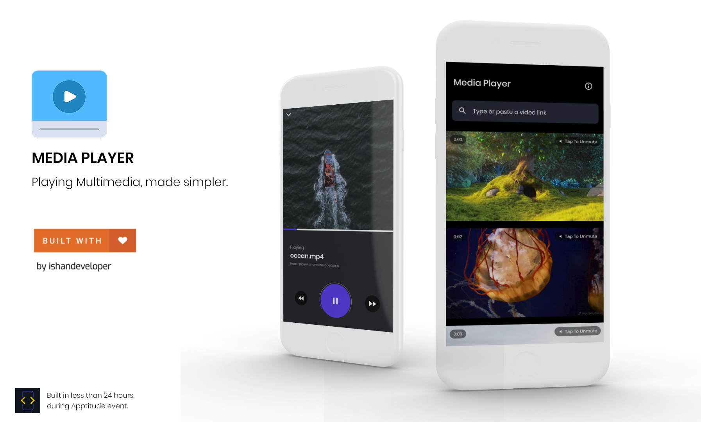
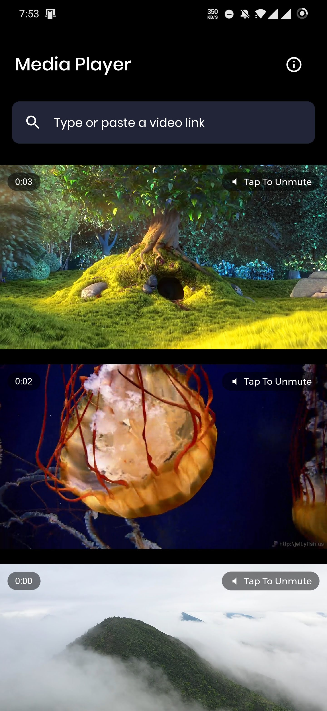
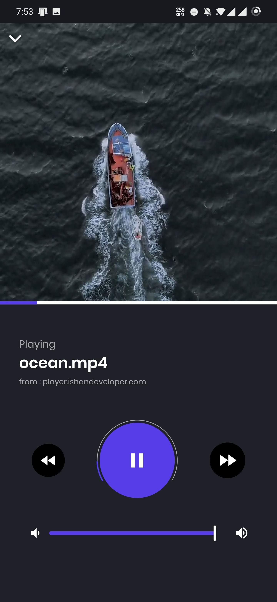

#### Bachmanity Apptitude Submission


## Media Player


### Problem Statement

#### - Easy :

    Implement a media player

#### - Medium :

    Stream Videos From URL without external APIs

####  Hard :

<pre>
Write Unit tests for your application and make sure maximum code coverage is present.
</pre>

### Features

1. **Video Feed** Integrated firebase, and a feed similar to instagram. Users can see dynamically updated video content in form of a scrollable feed.

1. **Haptic Vibration** Whenever a user changes the focus on another video, he/she will precieve a haptic interaction.

1. **Auto mute** If a user taps to unmute one of the videos in the feed, the previously unmuted video will automatically get muted 😉

1. **Caching** All the videos that you play are automatically cached on the user's device smartly, so that you don't need to worry about bandwidth costs, also the cache will be cleared automatically, once it exceeds a limit of 800MB.

1. **Multiple Aspect Ratios** The Video Player Component will automatically resize itself to Aspect ratio of the video. So, no more cropping ;)

1. **Playing from custom url** Don't like the videos in the feed? You can just type or paste any video url and see it in action.

1. **Advanced Controls** Seek, pause, play, rewind, forward, change volumes whatever you want and even natural gestures such as drag to dismiss video.

1. **Beautiful, yet simplistic UI** Every single interaction in the app is crafted with lots of love to feel as user-friendly as possible.

## Screenshots
Some Sneak Peeks ...

&nbsp;&nbsp;&nbsp;

### Submission Demo Video
<pre><a href="https://drive.google.com/file/d/13r7V3x5bRSjex8UHduvwbvJIOshX3d8K/view?usp=sharing">https://drive.google.com/file/d/13r7V3x5bRSjex8UHduvwbvJIOshX3d8K/view?usp=sharing</a></pre>

#### Download The APK:
and test it out on your devices!

<pre><a href="./app.apk">app.apk</a></pre>


## Setup

  ##### Clone the repository
```bash
git clone https://github.com/ishandeveloper/Apptitude-Media-Player.git
```
  ##### Move to the desired folder
```bash
cd \Apptitude-Media-Player
```

  ##### To run the app, simply write
```bash
flutter run
```


For help getting started with Flutter, view the online documentation, which offers tutorials, samples, guidance on mobile development, and a full API reference.

##### Made with ♥ by <a href="https://github.com/ishandeveloper">ishandeveloper</a>


[](https://github.com/ishandeveloper)
